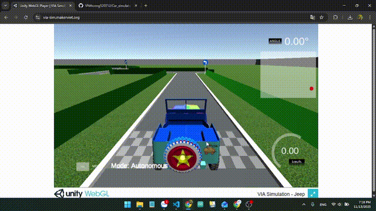

# Autonomous Car Simulation Controller

This project focuses on optimizing code to enable an autonomous car to operate within the web simulation environment found at [https://via.makerviet.org/vi/docs/autonomous-on-simulation/hello-via/](https://via.makerviet.org/vi/docs/autonomous-on-simulation/hello-via/).



## Project Overview

This project's core functionality revolves around processing real-time image data streamed via WebSockets from the VIA web simulation. We leverage computer vision (CPV) techniques to handle these images effectively. Our approach includes lane detection based on color, and subsequently, we analyze the size and shape of identified lanes to determine the optimal steering angle for the autonomous car. A key highlight of this project is its efficient design, allowing it to run smoothly on personal computers without needing a dedicated GPU.

## Features

* **Autonomous Navigation:** Controls a simulated car on the VIA platform.
* **Traffic Sign Recognition:** Utilizes a compact ONNX AI model for efficient and accurate sign detection.
* **Instruction Following:** The car processes recognized signs and executes corresponding actions.
* **Code Optimization:** Focuses on efficient code for real-time performance within the simulation.

## Getting Started

To get started with this project, follow these steps:

1.  **Follow VIA's Official Setup Guide:**
    First, you'll need to familiarize yourself with the basic operation of the VIA simulation. Please go through the setup process detailed in the official VIA documentation: [https://via.makerviet.org/vi/docs/autonomous-on-simulation/hello-via/](https://via.makerviet.org/vi/docs/autonomous-on-simulation/hello-via/). This guide will provide you with the fundamental knowledge to run the basic simulation and understand its workings.

2.  **Install Project Dependencies:**
    Once you're familiar with the VIA setup, navigate to the **V0.1** directory within this repository. Open your terminal or command prompt in this directory and install the required Python libraries using the `requirements.txt` file:

    ```bash
    pip install -r requirements.txt
    ```

## Contributing

This project is a collaborative effort by:

* **[VNthcong520712](https://github.com/VNthcong520712)**
* **[NguyenLeMinh-dev](https://github.com/NguyenLeMinh-dev)**
* **[truongedu](https://github.com/truongedu)**

## Repository

The project's code is hosted on GitHub: [https://github.com/VNthcong520712/Car\_simulator\_controller](https://github.com/VNthcong520712/Car_simulator_controller)


